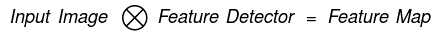
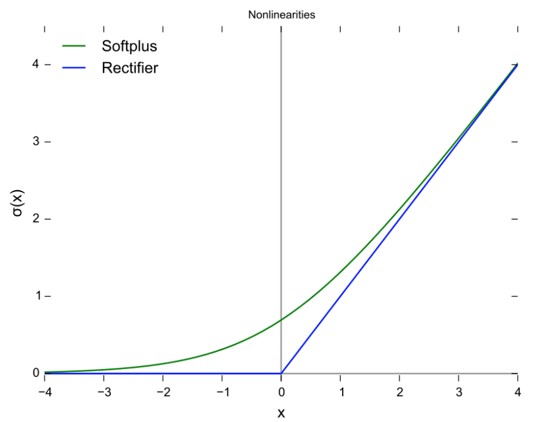
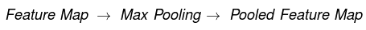
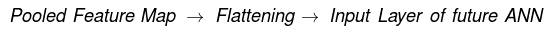
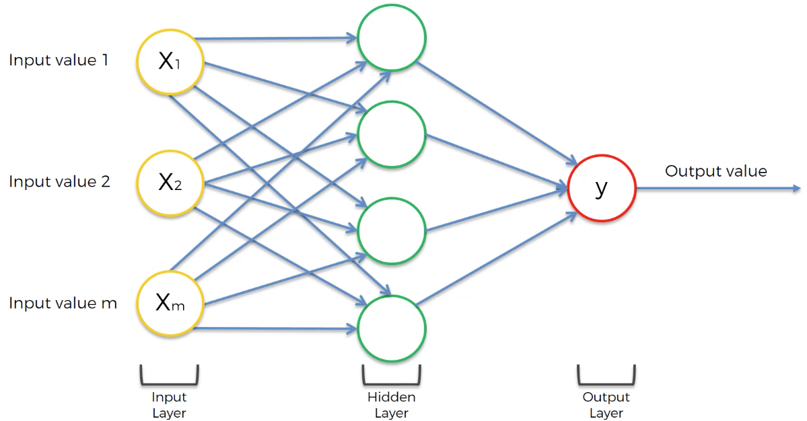
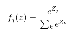
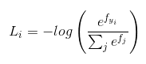

# Is it a cat or a dog?

We will be using a "Convolution Neural Network" to classify images of dogs and cats

## Convolution Neural Networks

Convolution Neural Networks (CNN) are most commonly applied to analysing visual imagery or "Computer Vision". An image is used as an input, it is processed through the CNN and the output label gives us a probability of which class the image belongs to. In short there are 4 steps to this, they are:

- Convolution + ReLu layer
- Max Pooling
- Flattening
- Full Connection

### Step 1: Convolution

In this step, we find features in our image using the "Feature Detector" and put them into a "Feature Map". This relationship is given below.

**Convolution summary**

- The Feature Detector is used to detect certain features and the Feature Map captures key features. 
- The Feature Map preserves key features and discards unnecessary information.
- This process makes the image smaller, resulting in faster processing.
- When applying the feature detector we lose some information as we have less values in the resulting matrix. However, the purpose of the Feature Detector is to detect certain features or integral parts of the image.
- The higest number in our Feature Map is when the pattern matches up.
- We have a perfect match when: 
  - The sum of the Feature Detector = Number in the square (cell) of the Feature Map.
- The Feature Map captures/preserves key features we look out for and discards unnecessary information that does not help us determine the image.

### ReLu Layer

ReLu stands for "Rectified Linear Units", which is the Rectifier Activation function. This is an additional step to the convolution step. We apply the Rectifier as we want to increase non-linearity in our image/CNN. This is due to images being highly non-linear as there may be different objects next to each other or in the background. The diagram below shows the ReLu function: f(x) = max(x,0), in comparison to the softplus function.

### Step 2: Max Pooling

In this step, we eliminate further unnecessary data by "Max Pooling". 

**Max Pooling summary**

- We place a 2x2 box on top of the Feature Map and select the largest number in the 2x2 box, and enter it into the "Pooled Feature Map".
- This gets rid of 75% of the information that is not feature data, therefore no longer requiring this data.
- We now introduce spatial invariance: As we're taking the maximum of the values, we're taking into consideration any distortions. For example, in the Feature Map if the distinctive feature we're looking out for is a position different to the expected Feature Map, the maximum number will be in the same position in the Pooled Feature Map. Note: Any vaguely similar features will not score high enough.
- We have reduced the number the number of parameters that will go into the final layers of the Neural Network. This prevents overfitting of current information as we should only be feature based.

### Step 3: Flattening

In this step a (nxn) Feature Map is flattened into a (mx1) matrix where m = nxn.

### Step 4: Full Connection

In this step, we've added a whole Artificial Neural Network to our Convolution Neural Network. This is illustrated by the diagram below.

After the flattening step, the Pooled Feature Map has become the input layer of the ANN. The ouput layer produces probabilities of what class/category the picture belongs to. Unlike ANN, CNN have fully connected hidden layers. This means each node is connect to each input value.

### Softmax and Cross-Entropy

The softmax function ensures that all output values have a probability between 0 and 1, and that they all add to become 1. 

**Classification Error**

This is the number of falsely categorised pictures. For accuracy calculations, we have Mean Square Error and Cross-Entropy. An advantage of using Cross-Entropy is that it contains a logarithmic term, therefore helping the Neural Network assess small errors. This is due to small differences being magnified by the logarithmic term, deeming it a significant improvement. The Neural Network with therefore arrive at the optimal state much quicker using Cross-Entropy. As a rule of thumb, Cross-Entropy is better suited towards classification and Mean Square Error is better suited towards regression. 

- **Softmax Function**

This ensures that the output values add up to 1.

- **Cross-Entropy Function**

A way of calculating the loss function and optimising our network.

### References

Online latex editor: https://www.codecogs.com/latex/eqneditor.php

ReLu Graph: https://en.wikipedia.org/wiki/Rectifier_(neural_networks)#/media/File:Rectifier_and_softplus_functions.svg

ANN digram: https://www.udemy.com/course/machinelearning/
